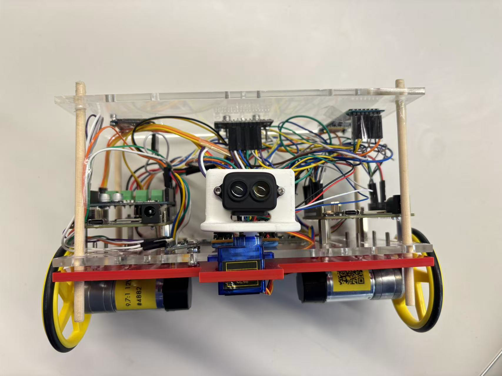
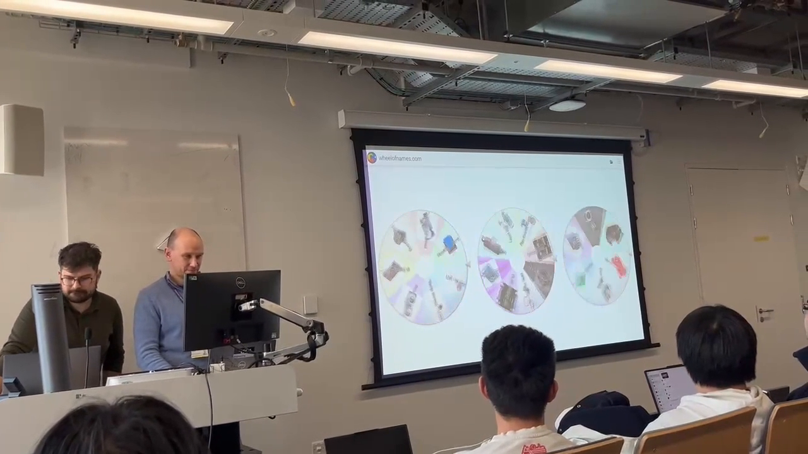
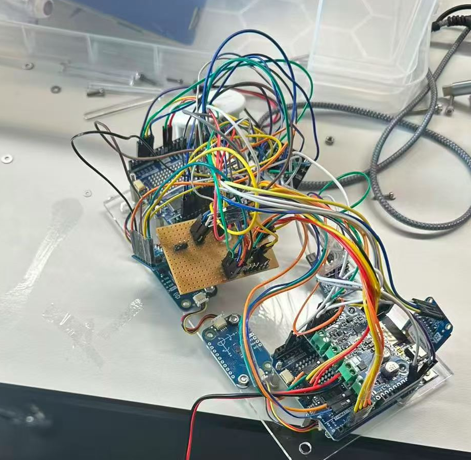
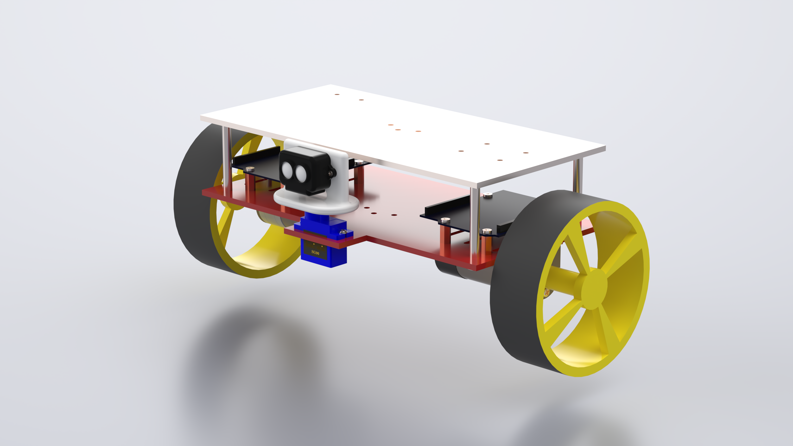
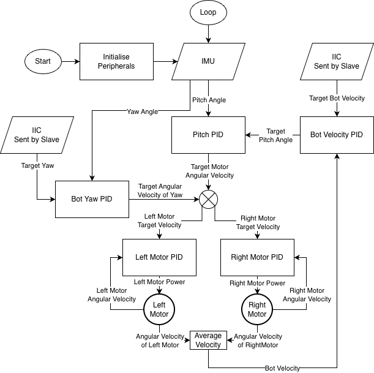
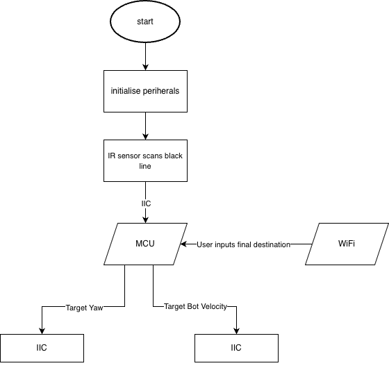
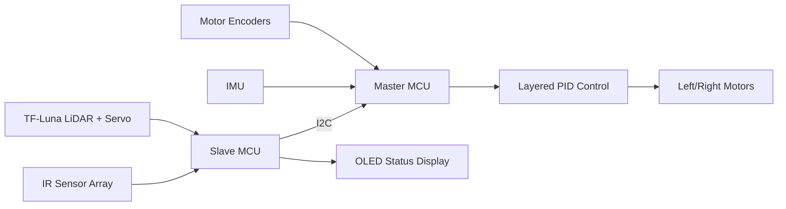

# AIPS - Autonomous Indoor Provision System

A dual-MCU autonomous indoor delivery robot for structured indoor environments. The system integrates encoder-based motor control, IMU-assisted pitch stabilisation, IR line tracking, servo-mounted LiDAR obstacle scanning, OLED status display, and layered PID control.

## Highlights

- Dual-MCU master/slave architecture
- Five-layer PID control: pitch, yaw, velocity, left motor, and right motor
- Encoder feedback for wheel speed estimation
- IMU-assisted pitch stabilisation
- Servo-mounted TF-Luna LiDAR scanner
- IR reflective line tracking
- Autonomous indoor delivery workflow

## Demo

- Demo video: [docs/videos/aips_demo.mp4](docs/videos/aips_demo.mp4) ([Google Drive mirror](https://drive.google.com/file/d/1HZciD1yVB_ZqC3lFDEw2mFEVtS_SPYBC/view))
- Robot photo: TODO (`docs/images/robot_photo.jpg`)
- System diagram: TODO (`docs/images/system_architecture.png`)
- Control architecture: TODO (`docs/images/control_architecture.png`)



[](docs/videos/aips_demo.mp4)

Development and project diagrams:










## Why This Project Matters

This is not just an Arduino car. AIPS is a complete embedded robotics system involving:

- Dual-MCU architecture
- Real-time motor control
- Encoder feedback
- IMU stabilisation
- Line tracking
- Obstacle detection
- I2C communication
- PID tuning
- Modular embedded C++ code

## My Contributions

- Designed the dual-MCU system architecture.
- Implemented PID motor control loops.
- Integrated encoder feedback for motor speed estimation.
- Developed the I2C communication layer between controller boards.
- Implemented the LiDAR scanning subsystem with servo control.
- Designed and integrated the mechanical structure.
- Set up the PlatformIO build structure for separate master and slave firmware.

## System Overview

The robot is split across two Arduino Uno R4 WiFi based controllers.

- Master MCU:
  - Motor control
  - Encoder feedback
  - IMU feedback
  - PID control
  - Communication with the slave MCU

- Slave MCU:
  - IR line tracking
  - LiDAR scanning
  - Servo control
  - OLED display
  - Navigation state logic



## Key Features

- Dual-MCU master/slave embedded architecture
- Encoder-based wheel velocity estimation
- Cascaded/layered PID control
- IMU-assisted pitch stabilisation
- IR reflective line tracking
- Servo-mounted TF-Luna LiDAR obstacle scanning
- OLED-based robot status feedback
- I2C communication between controllers
- PlatformIO embedded C++ project structure

## Control Architecture

AIPS uses multiple PID loops to separate low-level actuation from higher-level motion behaviour:

- Left motor speed control
- Right motor speed control
- Yaw / direction correction
- Pitch stabilisation
- Translational velocity regulation

The intended control bandwidth separation is:

```text
velocity loop < yaw loop < pitch loop < motor speed loop
```

This keeps slower navigation-level adjustments from fighting faster stabilisation and motor response loops.

## Engineering Challenges

### Synchronising Master and Slave MCU

The system splits sensing, navigation state, and actuation across two controller boards. This required a clear master/slave communication contract so that line tracking, LiDAR scanning, status display, motor control, and IMU feedback could run without blocking one another.

### PID Tuning

The robot uses several coupled control loops, including motor speed, yaw/direction correction, pitch stabilisation, and translational velocity regulation. Tuning required balancing response speed against stability so that faster low-level loops did not fight slower navigation-level behaviour.

### Sensor Integration

The project combines encoder feedback, IMU readings, IR reflectance sensing, and LiDAR distance measurements. Each sensor has different timing, noise, and interface constraints, so the firmware had to keep sensing and actuation modular while preserving predictable real-time behaviour.

## Hardware

| Component                        | Purpose                                |
| -------------------------------- | -------------------------------------- |
| Arduino Uno R4 / MCU boards      | Master/slave control                   |
| Pololu gear motors with encoders | Differential drive + velocity feedback |
| IMU                              | Pitch/orientation feedback             |
| QTRX IR sensor array             | Line tracking                          |
| TF-Luna LiDAR                    | Obstacle detection                     |
| SG90 servo                       | LiDAR scanning                         |
| OLED displays                    | Status and radar display               |
| Motor driver                     | Motor actuation                        |
| Battery / power system           | Robot power                            |

## Software Structure

| Path             | Description                          |
| ---------------- | ------------------------------------ |
| `src/`           | Main embedded source code            |
| `include/`       | Shared header files and interfaces   |
| `docs/`          | Reports, datasheets, and diagrams    |
| `flowcharts/`    | Exported system/state diagrams       |
| `utils/`         | Utility scripts and tuning tools     |
| `platformio.ini` | PlatformIO project configuration     |
| `pid_config.json`| PID configuration parameters         |

## Repository Structure

```text
.
├── docs/
│   ├── images/
│   ├── *.drawio
│   └── hardware datasheets and reports
├── flowcharts/
│   └── exported workflow diagrams
├── include/
│   └── shared C++ headers
├── src/
│   ├── master_mcu/
│   │   ├── include/
│   │   └── src/
│   └── slave_mcu/
│       ├── include/
│       └── src/
├── utils/
│   └── control, GUI, and image conversion tools
├── pid_config.json
└── platformio.ini
```

## Build and Upload

This is a PlatformIO project with separate environments for the master and slave MCU firmware.

Build both environments:

```bash
pio run
```

Build a specific environment:

```bash
pio run -e uno_r4_master
pio run -e uno_r4_slave
```

Upload firmware:

```bash
pio run -e uno_r4_master --target upload
pio run -e uno_r4_slave --target upload
```

Open the serial monitor:

```bash
pio device monitor
```

## Pin Usage

### Master Board

| Pin No. | Function                | Connect to                                      |
| ------- | ----------------------- | ----------------------------------------------- |
| D0      | Serial RX               | None                                            |
| D1      | Serial TX               | None                                            |
| D2      | Motor encoder interrupt | Left motor encoder A                            |
| D3      | Motor encoder interrupt | Right motor encoder A                           |
| D4      | Motor encoder read      | Left motor encoder B                            |
| D5      | Motor encoder read      | Right motor encoder B                           |
| D6      | Covered by motor driver | Covered by motor driver                         |
| D7      | Covered by motor driver | Covered by motor driver                         |
| D8      | Covered by motor driver | Covered by motor driver                         |
| D9      | Covered by motor driver | Covered by motor driver                         |
| D10     | Covered by motor driver | Covered by motor driver                         |
| D11     | Covered by motor driver | Covered by motor driver                         |
| D12     | Covered by motor driver | Covered by motor driver                         |
| D13     | Covered by motor driver | Covered by motor driver                         |
| A0      | None                    | None                                            |
| A1      | None                    | None                                            |
| A2      | None                    | None                                            |
| A3      | None                    | None                                            |
| A4      | I2C SDA                 | Modulino IMU, Modulino buzzer, Motoron, slave board |
| A5      | I2C SCL                 | Modulino IMU, Modulino buzzer, Motoron, slave board |

### Slave Board

| Pin No. | Function   | Connect to                     |
| ------- | ---------- | ------------------------------ |
| D0      | Serial RX  | None                           |
| D1      | Serial TX  | None                           |
| D2      | IR reading | IR reading 1                   |
| D3      | IR reading | IR reading 2                   |
| D4      | IR reading | IR reading 3                   |
| D5      | IR reading | IR reading 4                   |
| D6      | Servo PWM  | Servo                          |
| D7      | IR reading | IR reading 5                   |
| D8      | OLED RST   | OLED 1362 RES                  |
| D9      | OLED DC    | OLED 1362 DC                   |
| D10     | OLED CS    | OLED 1362 CS                   |
| D11     | SPI MOSI   | OLED 1362 MOSI                 |
| D12     | SPI MISO   | OLED 1362 MISO                 |
| D13     | SPI SCK    | OLED 1362 SCK                  |
| A0      | IR reading | IR reading 6                   |
| A1      | IR reading | IR reading 7                   |
| A2      | IR reading | IR reading 8                   |
| A3      | IR reading | IR reading 9                   |
| A4      | I2C SDA    | OLED 1306, LiDAR, master board |
| A5      | I2C SCL    | OLED 1306, LiDAR, master board |

## Component Details

### OLED 1362 SPI

| Pin No. | Symbol | Function          | Connect to |
| ------- | ------ | ----------------- | ---------- |
| 1       | GND    | Ground            | GND        |
| 2       | VCC    | 1.65 V - 5.5 V    | 5 V        |
| 3       | D0     | SPI SCLK          | SD13/SPI   |
| 4       | D1     | SPI MOSI / SDIN   | SD11/SPI   |
| 5       | RES    | Reset             | SD8        |
| 6       | D/C    | Data or control   | SD9        |
| 7       | CS     | Chip select       | SD10       |

### OLED 1306 I2C

| Pin No. | Symbol | Function  | Connect to |
| ------- | ------ | --------- | ---------- |
| 1       | VCC    | 7 V - 15 V| 5 V        |
| 2       | GND    | Ground    | GND        |
| 3       | SCL    | I2C clock | SA5 / SSCL |
| 4       | SDA    | I2C data  | SA4 / SSDA |

### Pololu Motor 1

9.7:1 Metal Gearmotor 25Dx63L mm LP 12 V with 48 CPR Encoder #4882.

| Pin Color | Function                   | Connect to |
| --------- | -------------------------- | ---------- |
| Red       | Motor power +              | Ext ~12 V  |
| Black     | Motor power -              | Ext ~12 V  |
| Green     | Encoder GND                | GND        |
| Blue      | Encoder VCC (3.5 V - 20 V) | 5 V        |
| Yellow    | Encoder A                  | MD2        |
| White     | Encoder B                  | MD4        |

### Pololu Motor 2

9.7:1 Metal Gearmotor 25Dx63L mm LP 12 V with 48 CPR Encoder #4882.

| Pin Color | Function                   | Connect to |
| --------- | -------------------------- | ---------- |
| Red       | Motor power +              | Ext ~12 V  |
| Black     | Motor power -              | Ext ~12 V  |
| Green     | Encoder GND                | GND        |
| Blue      | Encoder VCC (3.5 V - 20 V) | 5 V        |
| Yellow    | Encoder A                  | MD3        |
| White     | Encoder B                  | MD5        |

### IR Sensor Array

QTRX-HD-09RC Reflectance Sensor Array: 9-channel, 4 mm pitch, RC output, low current #4309.

| Pin / Channel | Function        | Connect to |
| ------------- | --------------- | ---------- |
| 1             | IR reading 1    | SD2        |
| 2             | IR reading 2    | SD3        |
| 3             | IR reading 3    | SD4        |
| 4             | IR reading 4    | SD5        |
| 5             | IR reading 5    | SD7        |
| 6             | IR reading 6    | SA0        |
| 7             | IR reading 7    | SA1        |
| 8             | IR reading 8    | SA2        |
| 9             | IR reading 9    | SA3        |

### TF-Luna LiDAR

| Pin No. | Color  | Symbol | Function     | Connect to |
| ------- | ------ | ------ | ------------ | ---------- |
| 1       | White  | +5V    | Power supply | 5 V        |
| 2       | Blue   | SDA    | I2C data     | SA4 / SSDA |
| 3       | Green  | SCL    | I2C clock    | SA5 / SSCL |
| 4       | Yellow | GND    | Ground       | GND        |
| 5       | Black  | None   | None         | None       |
| 6       | Red    | None   | None         | None       |

## What I Learned

- Designing modular embedded robotics software
- Handling real-time constraints across sensing and actuation
- Tuning coupled PID loops
- Debugging encoder/IMU feedback
- Integrating hardware, firmware, and mechanical design

## Future Improvements

- Add SLAM-based localisation
- Improve obstacle avoidance beyond threshold detection
- Add a ROS 2 bridge
- Improve mechanical robustness
- Log telemetry for PID analysis
- Add autonomous path planning

## License

License: TODO. This project is currently shared for portfolio and educational purposes.
